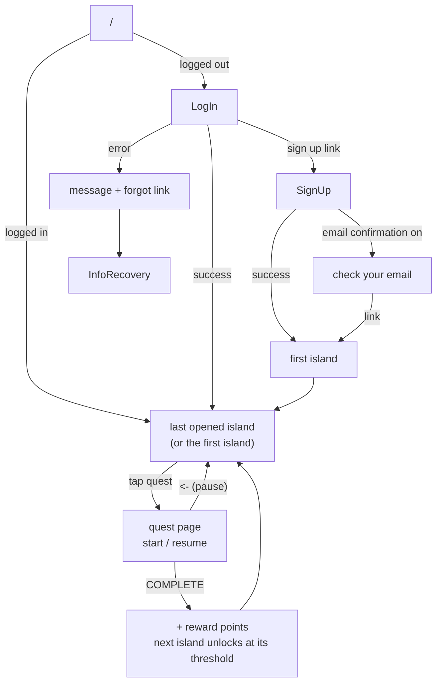

# Ikko!! (いっこ〜！！)
SLS480E Team 3 Japanese learning App for Beginners

## Vercel link

[WEB LINK](https://ikko.vercel.app/)
for dev purpose some auth fields are disabled

## Target

[TBD]

## Story Line

[TBD]

## Lessons format

[TBD]

## App Flow



### Routes

| Route | Page | Notes |
|---|---|---|
| `/` | redirect | logged out goes to `/LogIn`; logged in goes to the last island opened |
| `/SignUp`, `/LogIn` | auth forms | already logged in goes to `/` |
| `/Game/[island]` | IslandScene | login required. Locked island goes back to your own island |
| `/Game/[island]/[quest]` | QuestScene | login required. First visit starts the quest; later visits resume it |
| `/InfoRecovery`, `/EditInfo` | account | password reset / edit profile |
| `/Dev`, `/MobileTester` | dev only | open logged in or out |

### Rules

- **First island** (lowest `sort_order`) is always unlocked. New accounts get it at sign-up.
- **Last island.** Opening an island saves it as `profiles.last_island_id`. `/` and LogIn send you back there.
- **Quest states.**
  - Not started: no `user_quests` row.
  - Paused, shown as `(resume)`: the row exists and `completed_at` is null.
  - Done, shown as `(done)`: `completed_at` is set.
- **Complete.** Points are only added the first time a quest is completed. The next island unlocks once your points on the current island reach the next island's `threshold`.
- **Guards.**
  - `src/proxy.ts` sends logged-out visitors to `/LogIn`.
  - The pages do the rest of the checks (locked island, quest under the wrong island).

See [page-relations.md](page-relations.md) for the full list of redirects.

## World View

The world is drawn at a **10 : 7** aspect ratio: a square patch of ground shows up 10 wide and 7 tall. That makes the camera look diagonally down at the ground.

- **Angle:** about **44.4° below the horizon**, or about **45.6° tilted from straight down**.
- **Where it comes from:** a slanted view keeps width but squashes depth by sin θ, where θ is the angle between the line of sight and the ground. So sin θ = 7 / 10 = 0.7, and θ = arcsin(0.7) ≈ 44.43°.
- **For art:** draw sprites and tiles as seen from about 45° above. Ground-level shapes (tiles, shadows, hitboxes) are 0.7× as tall as they are wide.
- **Hitbox `h` is depth.** A game object's `hitBox` (`src/components/Game/Object/gameObject.ts`) lies flat on the ground. Its `h` is how deep the object's footprint reaches along y (into the screen), not how tall the object stands. Size it to the sprite's base, not the whole sprite.
  - **Tall sprites.** For a tall sprite like the tower, the hitbox sits at the bottom. The player can walk behind the upper part and is only stopped at the base.
  - **Square footprints.** A footprint that is square on the ground has `h ≈ w × 0.7`. For example, a base 110 wide and 110 deep uses `h: 77`.

## NPCs and Dialog

### Talking to an NPC

1. **Walk close.** Within `TALK_RANGE` (24 world px) of an NPC, a speech bubble with its greeting appears above it.
2. **Tap the NPC or its bubble.** The joystick is released and the camera zooms in to `TALK_ZOOM` (3×). Only NPCs showing a bubble can be tapped.
3. **Tap again to advance.** Each tap shows the next line. Taps are ignored until the zoom-in has settled.
4. **After the last line**, one more tap zooms back out to where you were and ends the talk.

While a talk is on, the other NPCs hide their greetings and can't be tapped.

### Dialog bubble

- Japanese types one character at a time, 12 characters per page. A full page holds for 1.2 s, then the next page starts.
- The English translation types under the Japanese at 0.35× the font size, after the line's last Japanese page.
- The bubble is sized to the full page from the start, so it doesn't grow while typing.

### Which lines an NPC says

An NPC's lines are a `Dialog[]` (`src/components/Game/Entity/dialogBubble.tsx`):

```ts
type Dialog = {
    condition: 'greeting' | 'spoken' | 'questCleared' | 'default'
    jp: string | string[]  // one line per tap
    en: string | string[]  // en[i] is the translation of jp[i]
}
```

| Condition | When it plays |
|---|---|
| `greeting` | In the bubble while you're in range and not talking. Falls back to こんにちは / Hello |
| `questCleared` | Tapped, and the NPC's `quest.status` is `'done'` |
| `spoken` | Tapped, and you already finished a talk with this NPC in this scene |
| `default` | Tapped, when nothing above matches |

On a tap, `pickDialog` goes down the list `questCleared` → `spoken` → `default` → `greeting` and plays the first entry the NPC has. An NPC with only a greeting just repeats it and zooms back out.

- **"Spoken"** is set once you tap past the last line, so the entry never switches mid-talk.
- **Only in memory.** "Spoken" resets when the scene reloads; it isn't saved to the database.

### Adding NPCs

NPCs live in `src/components/Game/npcs/npcs.ts` and are listed per island in `src/components/Game/npcs/index.ts` (`ISLAND_NPCS`, keyed by `islands.id`). Write each line as a `[Japanese, English]` pair with `say()`:

```ts
npc('Jordi', 3420, 5070, 'plum', [
    say('greeting', ['こんにちは！', 'Hello!']),
    say('default',
        ['わたしはすしがすき！', 'I love sushi!'],
        ['とくにサーモンがすき', 'Salmon is my favorite']),
    say('spoken', ['また、すしのはなししよう', "Let's talk sushi again"]),
]),
```

- **Fixed spots.** Positions are world px and should stay fixed rather than random, so server and client render the same.
- **Keep clear.** Place NPCs outside object hitboxes and away from the spawn.
- **Short lines.** Aim for 12 characters or fewer, so a line fits one page.
- **Kana only.** No kanji yet; there's no furigana.
- **Testing.** Check NPCs at `/MobileTester` → "game scene" (no login needed); "dialog bubble" previews a single bubble.


### Credits
- **Team Lead / PM** Jordi Yamauchi (https://github.com/jordiyamauchi)
- **UX/UI Designer** Sarah Wong(https://github.com/sarahw8-byte)
- **Instructional Designer** Tiffany Horimoto(https://github.com/tshori1128)
- **Lead Developer** Shuto Nishida (https://github.com/shuton-gif)
- **Research & Testing Lead** Genki Ando (https://github.com/genkiand0)

### Assets
EnglishFont Credit [TBD]
JapaneseFont Credit [TBD]
