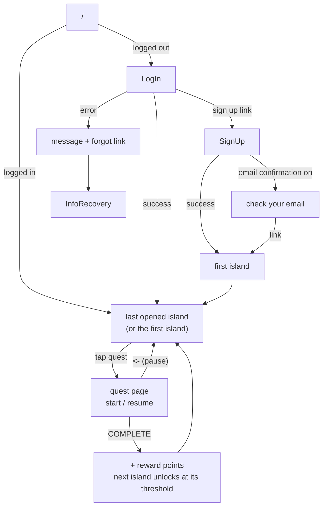

# Ikko!! (いっこ〜！！)
SLS480E Team 3 Japanese learning App for Beginners

## VER

## Target

[TBD]

## Story Line

[TBD]

## Lessons format

[TBD]

## App Flow

### Routes

| Route | Page | Notes |
|---|---|---|
| `/` | redirect | logged out goes to `/LogIn`; logged in goes to the last island opened |
| `/SignUp`, `/LogIn` | auth forms | already logged in goes to `/` |
| `/Game/[island]` | IslandScene | login required. Locked island goes back to your own island |
| `/Game/[island]/[quest]` | QuestScene | login required. First visit starts the quest; later visits resume it |
| `/InfoRecovery`, `/EditInfo` | account | password reset / edit profile |
| `/Dev`, `/MobileTester` | dev only | open logged in or out |

### Rules

- **First island** (lowest `sort_order`) is always unlocked. New accounts get it at sign-up.
- **Last island.** Opening an island saves it as `profiles.last_island_id`. `/` and LogIn send you back there.
- **Quest states.**
  - Not started: no `user_quests` row.
  - Paused, shown as `(resume)`: the row exists and `completed_at` is null.
  - Done, shown as `(done)`: `completed_at` is set.
- **Complete.** Points are only added the first time a quest is completed. The next island unlocks once your points on the current island reach the next island's `threshold`.
- **Guards.**
  - `src/proxy.ts` sends logged-out visitors to `/LogIn`.
  - The pages do the rest of the checks (locked island, quest under the wrong island).

See [page-relations.md](page-relations.md) for the full list of redirects.

### Credits
- **Team Lead / PM** Jordi Yamauchi (https://github.com/jordiyamauchi)
- **UX/UI Designer** Sarah Wong(https://github.com/sarahw8-byte)
- **Instructional Designer** Tiffany Horimoto(https://github.com/tshori1128)
- **Lead Developer** Shuto Nishida (https://github.com/shuton-gif)
- **Research & Testing Lead** Genki Ando (https://github.com/genkiand0)

### Assets
EnglishFont Credit [TBD]
JapaneseFont Credit [TBD]
